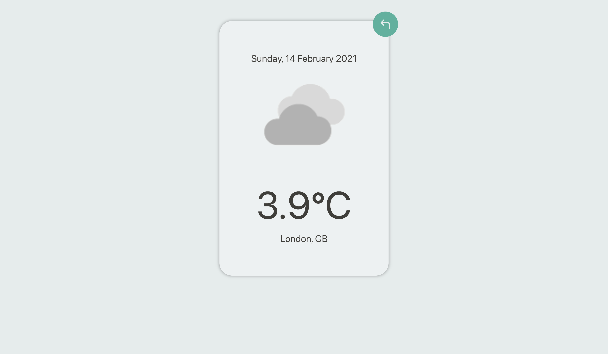

### Weather App

About The Project
A weather app that allows you search for any city in the world and get the weather forecast in real time or next 16 days. Temperature are in Celsius. The weather is served using Weatherbit API. All of the components of website is generated using Javascript and React.

[Project live link](https://miniweatherapp.herokuapp.com/)
## Contributing

Contributions, issues and feature requests are welcome! Start by:

- git clone https://github.com/harunkisacuk/weatherApp.git
- Change directory with cd weatherApp,
- Run yarn to install dependencies
- I deployed to heroku https://miniweatherapp.herokuapp.com/
- yarn start
- runs the "app" in dev mode. Open http://localhost:3000 to view it in your browser.

### Built With

This project was built using these technologies.

- Javascript
- ReactJS Hooks
- Atomic Design Pattern
- HTML/CSS
- Styled Component
- Axios
- React Icons
- React Select
- Jest
- React Testing Library

​Harun Kisac

- Github: [@harunkisacuk](https://github.com/harunkisacuk)
- Linkedin: [Harun Kisac](https://www.linkedin.com/in/harun-kisac/)
- E-mail: harunk3uk@gmail.com
